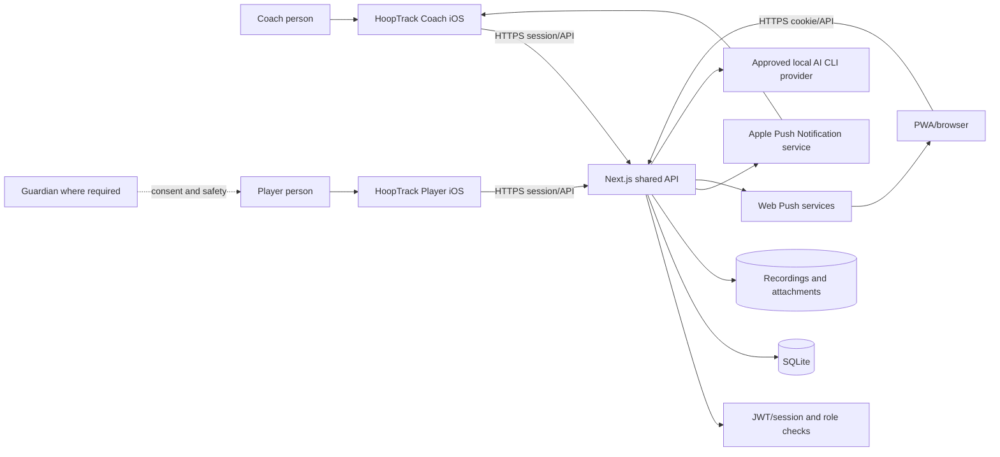
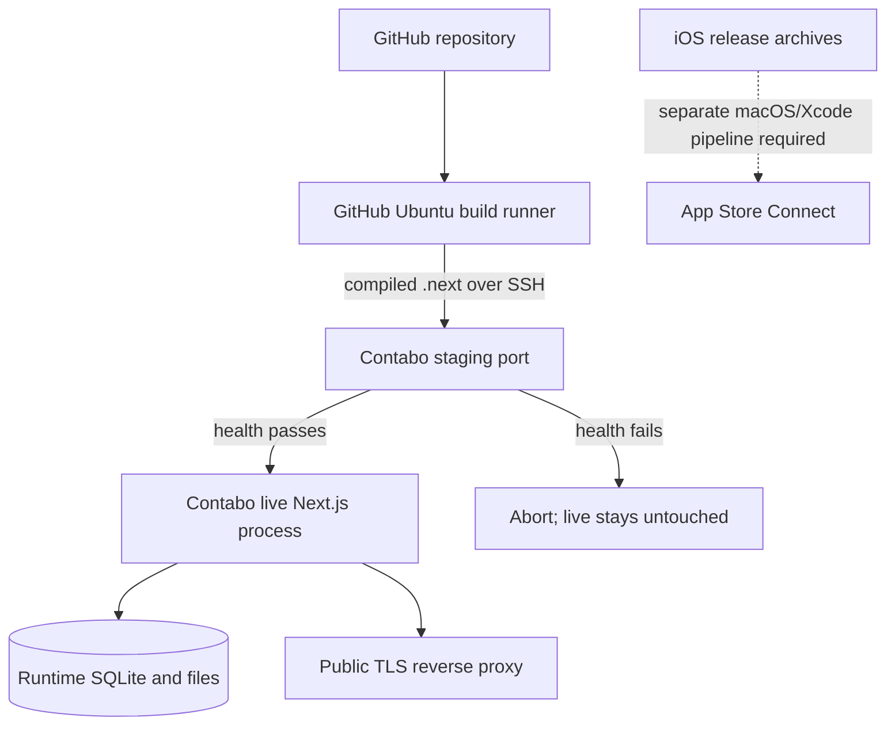
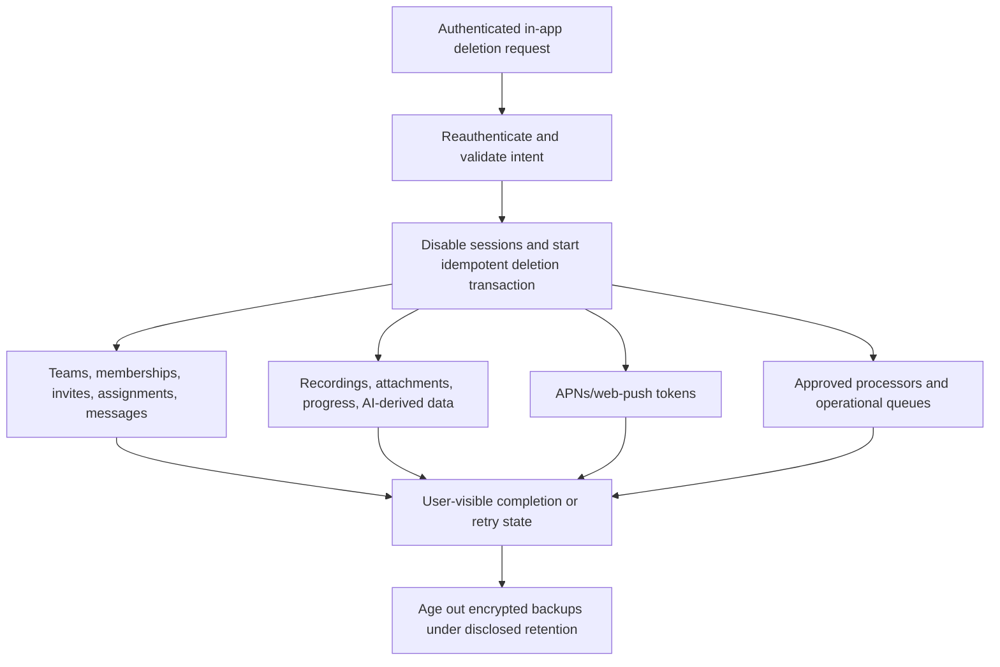

# HoopTrack Release Architecture and Trust Boundaries

**Status:** Phase 1 source-derived baseline. Runtime traffic and production infrastructure must still be reconciled during RC qualification.

## System context



## Deployment baseline



The checked-in workflow contains production cutover logic. Merely pushing `main` can invoke deployment; release work must use reviewed branches and must not merge/push to a deployment-triggering branch without explicit authorization.

## Trust boundaries

| Boundary | Untrusted input | Mandatory control to prove |
| --- | --- | --- |
| Person → native app | Credentials, names, team data, messages, media, AI prompts | Input limits, safe errors, consent, report/block, local secret protection |
| Native app → API | Cookie/session, role claim, resource IDs, uploads | TLS, server-side authentication and object authorization, rate limits, idempotency |
| Coach → Player relationship | Email invite and Coach identity | Intended-recipient binding, affirmative acceptance, expiry, revoke, capacity race protection, audit |
| API → database/files | Queries, filenames, object relationships | Parameterization, least privilege, canonical paths, ownership checks, retention/deletion |
| API → push providers | Device token and notification payload | Bundle/environment scoping, minimal payload, token removal, revoked-access safety |
| API → AI provider | Player context and generated output | Data minimization, timeouts, allowlisted environment, content safety, human-visible disclosure |
| Staff → production | Support/moderation/operations access | MFA, least privilege, audit log, approval, incident procedure |
| CI → production | Build artifact, SSH key, environment files | Protected secrets, immutable artifact, staging smoke test, explicit deploy approval, rollback |

## Coach invitation sequence

```mermaid
sequenceDiagram
  actor C as Coach
  participant CA as Coach app
  participant API as Shared API
  participant DB as Database
  participant PA as Player app
  actor P as Intended Player

  C->>CA: Enter team, Player email, optional message
  CA->>API: Create invitation (authenticated Coach)
  API->>API: Authorize team ownership; normalize; rate-limit
  API->>DB: Atomically create/deduplicate expiring intended-recipient invite
  API-->>CA: Privacy-safe status
  P->>PA: Open requests
  PA->>API: Fetch invitations (authenticated Player)
  API->>API: Authorize intended recipient
  API-->>PA: Coach identity, team, relationship, expiry, choices
  P->>PA: Accept or decline
  PA->>API: Respond once with invite ID and action
  API->>DB: Atomic expiry/revoke/capacity/status check
  alt accepted and capacity available
    DB-->>API: One membership; invite accepted
    API-->>PA: Membership confirmed
    API-->>CA: Roster/status updated
  else declined, expired, revoked, duplicate, or full
    DB-->>API: No unauthorized membership
    API-->>PA: Accurate actionable result
    API-->>CA: Privacy-safe status
  end
```

## Account and content deletion flow



## Environment and secret categories

| Category | Names | Storage rule |
| --- | --- | --- |
| Authentication | `JWT_SECRET` | Server secret store only; rotate with session invalidation plan |
| Web push | `VAPID_PUBLIC_KEY`, `VAPID_PRIVATE_KEY`, `VAPID_SUBJECT`, `NEXT_PUBLIC_VAPID_PUBLIC_KEY` | Only public key may reach clients |
| APNs | `APNS_TEAM_ID`, `APNS_KEY_ID`, `APNS_PRIVATE_KEY_P8` | Server secret store; never app bundle or Git |
| Storage | `HOOPTRACK_DB`, `RECORDINGS_DIR`, `ATTACHMENTS_DIR` | Environment-specific paths; backed up and access-controlled |
| AI | `CODEX_CLI_PATH`, `CLAUDE_CLI_PATH`, `AI_CLI_TIMEOUT_MS` | Approved server runtime only; no provider credentials in Git |
| Review automation | `APP_REVIEW_DEMO_ACCOUNTS_JSON` | CI/local secret only; durable non-personal accounts |
| KCLOUD/SSH | `CONTABO_*`, `KCLOUD_*`, `LOCAL_BRIDGE_PATH`, `GITHUB_REPOSITORY` | Cloud connector/settings; private key material only in Cloud secrets |

## Items that must be reconciled before release

- Confirm the actual production reverse proxy, DNS, TLS, process port, filesystem ownership, backup target, and monitoring topology.
- Decide and document whether Player receives native APNs; do not add capability without a product requirement.
- Replace or approve the hard-coded native service origin through an environment-safe configuration strategy and durable branded domain.
- Verify every API resource against an object-level authorization matrix, including negative guessed-ID and revoked-access cases.
- Confirm all AI execution and data transfer shown here matches production; remove unused providers from the data map.
- Confirm deletion behavior empirically across the database, files, queues, push tokens, logs, processors, and backups.
